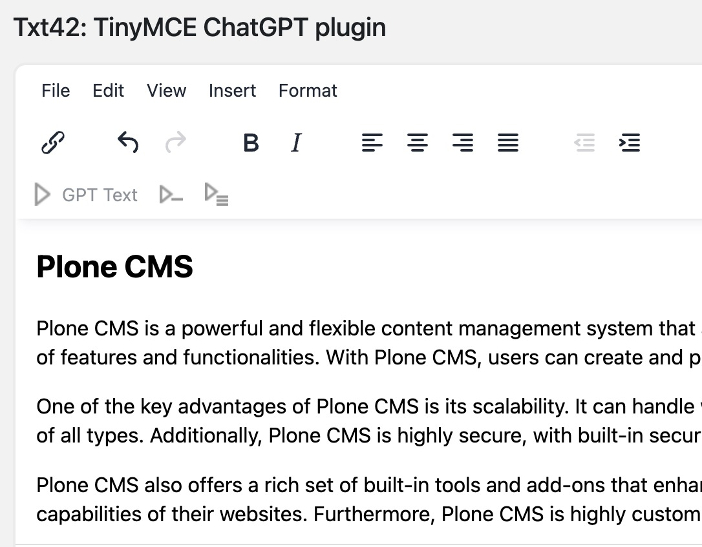

.. This README is meant for consumption by humans and PyPI. PyPI can render rst files so please do not use Sphinx features.
   If you want to learn more about writing documentation, please check out: http://docs.plone.org/about/documentation_styleguide.html
   This text does not appear on PyPI or github. It is a comment.

.. image:: https://github.com/collective/collective.txt42.chatgpt/actions/workflows/plone-package.yml/badge.svg
    :target: https://github.com/collective/collective.txt42.chatgpt/actions/workflows/plone-package.yml

.. image:: https://coveralls.io/repos/github/collective/collective.txt42.chatgpt/badge.svg?branch=main
    :target: https://coveralls.io/github/collective/collective.txt42.chatgpt?branch=main
    :alt: Coveralls

.. image:: https://codecov.io/gh/collective/collective.txt42.chatgpt/branch/master/graph/badge.svg
    :target: https://codecov.io/gh/collective/collective.txt42.chatgpt

.. image:: https://img.shields.io/pypi/v/collective.txt42.chatgpt.svg
    :target: https://pypi.python.org/pypi/collective.txt42.chatgpt/
    :alt: Latest Version

.. image:: https://img.shields.io/pypi/status/collective.txt42.chatgpt.svg
    :target: https://pypi.python.org/pypi/collective.txt42.chatgpt
    :alt: Egg Status

.. image:: https://img.shields.io/pypi/pyversions/collective.txt42.chatgpt.svg?style=plastic   :alt: Supported - Python Versions

.. image:: https://img.shields.io/pypi/l/collective.txt42.chatgpt.svg
    :target: https://pypi.python.org/pypi/collective.txt42.chatgpt/
    :alt: License

========================
collective.txt42.chatgpt
========================

Plone addon for ChatGPT

Features
--------

- Integrates the txt42.at CHAT-Gpt TinyMCE-Plugin into Plone CMS:: https://txt42.ai/

Installation
------------

Install collective.txt42.chatgpt by adding it to your buildout::

    [buildout]

    ...

    eggs =
        collective.txt42.chatgpt

and then running ``bin/buildout``

Alternative Installation
------------------------

Use pyenv, cookie-cutter & mxdev for a quick Plone installment::

   $ python3 -m venv venv
   $ venv/bin/pip install -U "pip" "wheel" "cookiecutter" "mxdev"
   $ make build

- and then running ``make start``
- Access Zope here:: http://127.0.0.1:8080/ 
- Create a Classic Plone Site
- Install the addon in the control panel
- A Chat-GPT button appears in TinyMCE Editor

Notes 
-----

- The installation of the plugin may changes prior TinyMCE Settings
- Use your own API Key and change it in TinyMCE Settings control panel -> Advanced
- More Information:: https://txt42.ai/

Authors
-------

Provided by awesome people ;)

Contributors
------------

- Roland Fasching:: https://www.cloud19.at/

Contribute
----------

- Issue Tracker: https://github.com/collective/collective.txt42.chatgpt/issues
- Source Code: https://github.com/collective/collective.txt42.chatgpt

License
-------

The project is licensed under the GPLv2.
